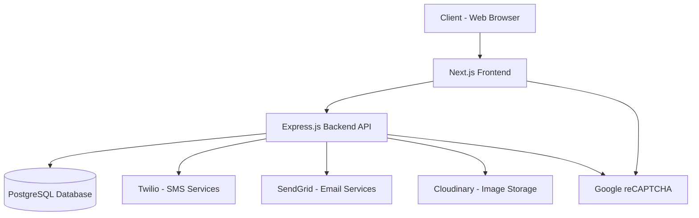

# Unskilled Labour Job Portal

## Project Summary

The Unskilled Labour Job Portal is a comprehensive digital platform designed to streamline the management of rural employment programs, specifically targeting the unorganized sector. This system facilitates the registration of workers, job card applications, work demand requests, project management, attendance tracking, and payment processing through a role-based access control system.

## Objective

The primary objective of this project is to digitize and optimize the rural employment process by providing:
- A centralized platform for workers to register and apply for job cards
- An efficient system for submitting and managing work demand requests
- Streamlined project management for government officials
- Transparent attendance tracking and payment processing
- Role-based access control ensuring data security and appropriate permissions

## Key Features

### User Management
- Multi-role authentication system (Worker, Supervisor, Admin)
- Secure registration with Aadhaar validation
- Email and phone number verification via OTP
- Password reset functionality
- Profile management with image upload capability

### Job Card System
- Digital job card registration
- Family details management
- Status tracking (pending, approved, rejected)
- Integration with government databases

### Work Demand Management
- Work demand request submission
- Approval workflow with supervisor review
- Priority-based request handling
- Status tracking and notifications

### Project Management
- Create, read, update, and delete projects
- Worker assignment to projects
- Project progress tracking
- Location-based project management

### Attendance & Payments
- Digital attendance tracking
- Work hour calculation
- Payment processing integration
- Payment history and reports

### Admin Dashboard
- User management and role assignment
- Project oversight and monitoring
- Work demand approval
- System analytics and reporting

### Security Features
- JWT-based authentication
- Google reCAPTCHA v3 protection
- Role-based access control
- Rate limiting to prevent abuse
- Secure image upload with Cloudinary integration

## Technology Stack

### Frontend
- **Next.js 14** - React framework with App Router
- **TypeScript** - Type-safe JavaScript development
- **Tailwind CSS** - Utility-first CSS framework
- **React Hook Form** - Form validation and management
- **React Google reCAPTCHA v3** - Bot protection
- **Axios** - HTTP client for API requests

### Backend
- **Node.js** - JavaScript runtime environment
- **Express.js** - Web application framework
- **TypeScript** - Type-safe server-side development
- **PostgreSQL** - Relational database management
- **Prisma** - Database ORM
- **JWT** - Token-based authentication
- **Twilio** - SMS services for OTP
- **SendGrid** - Email delivery services
- **Cloudinary** - Image management and storage

### DevOps & Tools
- **Git** - Version control system
- **GitHub** - Code repository and CI/CD
- **Docker** - Containerization (optional)
- **Nodemon** - Development server with hot reload
- **ESLint** - Code linting and formatting

## System Architecture



### Architecture Components

1. **Frontend Layer**
   - Next.js application providing the user interface
   - Responsive design for desktop and mobile access
   - Role-based UI rendering
   - Client-side form validation

2. **Backend Layer**
   - RESTful API built with Express.js
   - Business logic implementation
   - Authentication and authorization middleware
   - Data validation and sanitization

3. **Database Layer**
   - PostgreSQL relational database
   - Normalized schema design
   - Indexing for performance optimization
   - ACID compliance for data integrity

4. **External Services**
   - Twilio for SMS-based OTP verification
   - SendGrid for email notifications
   - Cloudinary for image storage and management
   - Google reCAPTCHA for bot protection

### Data Flow

1. **User Authentication**
   - User submits login/register request
   - Frontend validates input and adds reCAPTCHA token
   - Backend verifies reCAPTCHA and validates credentials
   - JWT tokens generated for authenticated sessions

2. **Job Card Registration**
   - Worker fills application form with personal details
   - Form data validated on frontend and backend
   - Application stored in database with pending status
   - Supervisor receives notification for review

3. **Work Demand Request**
   - Worker submits work demand with project preferences
   - Request routed to appropriate supervisor based on location
   - Supervisor reviews and approves/rejects request
   - Approved requests are assigned to available projects

4. **Attendance & Payment**
   - Daily attendance recorded by supervisor
   - Work hours calculated and stored
   - Payment requests generated based on attendance
   - Payment history tracked and reported

## API Endpoints

### Authentication
- `POST /api/v1/users/register` - User registration
- `POST /api/v1/users/login` - User login
- `POST /api/v1/users/refresh-token` - Refresh JWT token

### User Management
- `GET /api/v1/users/profile` - Get user profile
- `PUT /api/v1/users/profile` - Update user profile
- `GET /api/v1/users/workers` - Get all workers (Admin only)

### Job Card Applications
- `POST /api/v1/job-card-applications` - Submit job card application
- `GET /api/v1/job-card-applications` - Get user's applications
- `GET /api/v1/job-card-applications/:id` - Get specific application
- `PUT /api/v1/job-card-applications/:id/status` - Update application status (Supervisor/Admin)

### Work Demand Requests
- `POST /api/v1/work-demand-requests` - Submit work demand request
- `GET /api/v1/work-demand-requests` - Get user's requests
- `GET /api/v1/work-demand-requests/pending` - Get pending requests (Supervisor/Admin)
- `PUT /api/v1/work-demand-requests/:id/status` - Update request status

### Projects
- `POST /api/v1/projects` - Create project (Admin)
- `GET /api/v1/projects` - Get all projects
- `GET /api/v1/projects/:id` - Get specific project
- `PUT /api/v1/projects/:id` - Update project (Admin)
- `DELETE /api/v1/projects/:id` - Delete project (Admin)

### Attendance
- `POST /api/v1/attendance` - Record attendance (Supervisor)
- `GET /api/v1/attendance` - Get attendance records
- `GET /api/v1/attendance/worker/:id` - Get worker's attendance

## Security Measures

- **JWT Authentication**: Secure token-based authentication with refresh tokens
- **Role-Based Access Control**: Fine-grained permissions based on user roles
- **Input Validation**: Comprehensive validation on both frontend and backend
- **Rate Limiting**: Protection against brute force and DDoS attacks
- **reCAPTCHA Integration**: Protection against bot registrations and submissions
- **Encrypted Communications**: All data transmitted over HTTPS
- **Environment Variables**: Sensitive configuration stored securely

## Deployment

### Prerequisites
- Node.js >= 16.x
- PostgreSQL >= 12.x
- Twilio Account
- SendGrid Account
- Cloudinary Account
- Google reCAPTCHA v3 keys

### Environment Setup
1. Clone the repository
2. Install dependencies for both frontend and backend
3. Set up PostgreSQL database
4. Configure environment variables in `.env` files
5. Run database migrations
6. Start the development servers

### Development Commands
```bash
# Backend
cd backend
npm install
npm run dev

# Frontend
cd frontend
npm install
npm run dev
```

## Future Enhancements

- Mobile application development
- Integration with government databases
- Advanced analytics and reporting
- Multi-language support
- Offline functionality
- Blockchain-based payment verification